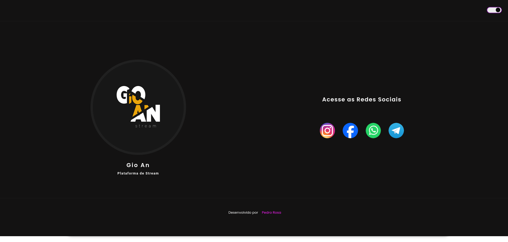

## License

This project is licensed under the MIT License - see the [LICENSE](LICENSE) file for details.

# Minimalist Bio Links

This is a minimalist bio links site that allows users to share various important information and links in one place.

## Features

- **Minimalist:** Clean and simple design for an uncomplicated user experience.
- **Responsive:** Designed for mobile devices.
- **Dark and Light Mode:** Support for dark and light mode for better user preference adaptation.

## Screenshots

<table>
  <tr>
    <td align="center"><b>Light Mode</b></td>
    <td align="center"><b>Dark Mode</b></td>
  </tr>
  <tr>
    <td align="center"></td>
    <td align="center"></td>
  </tr>
  <tr>
    <td align="center"></td>
    <td align="center"></td>
  </tr>
</table>

## How to Use

1. Clone this repository:

```bash
git clone https://github.com/pedrorosa-dev/bio-links.git
```
